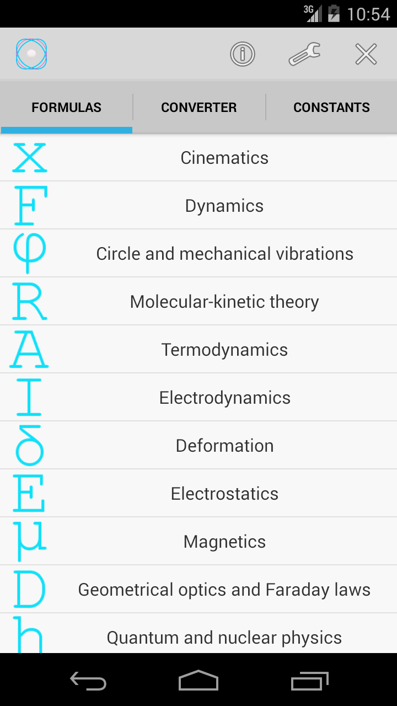
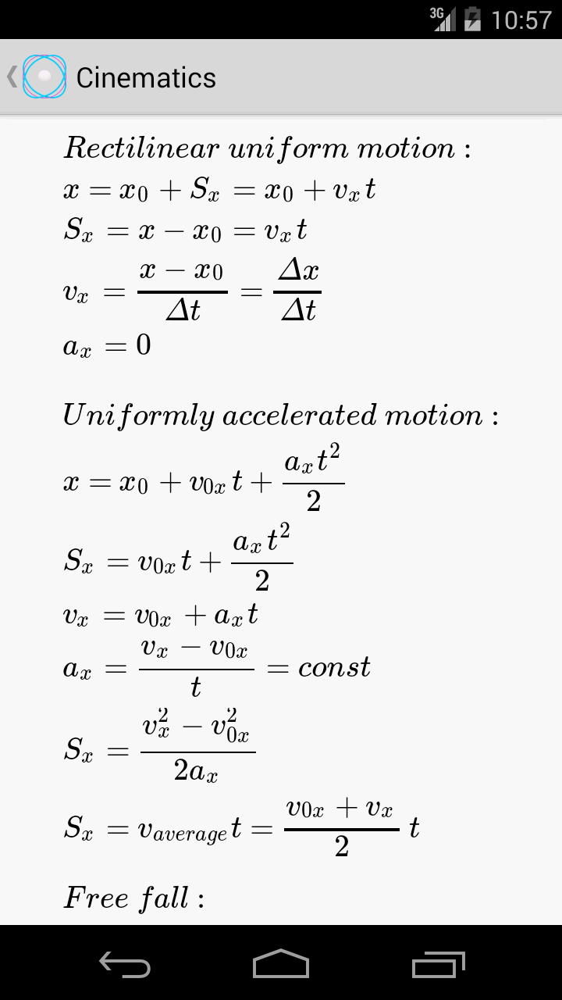
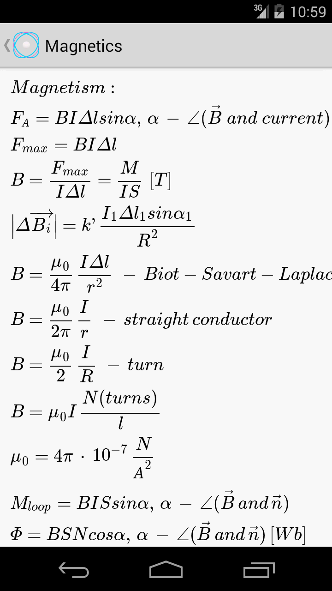
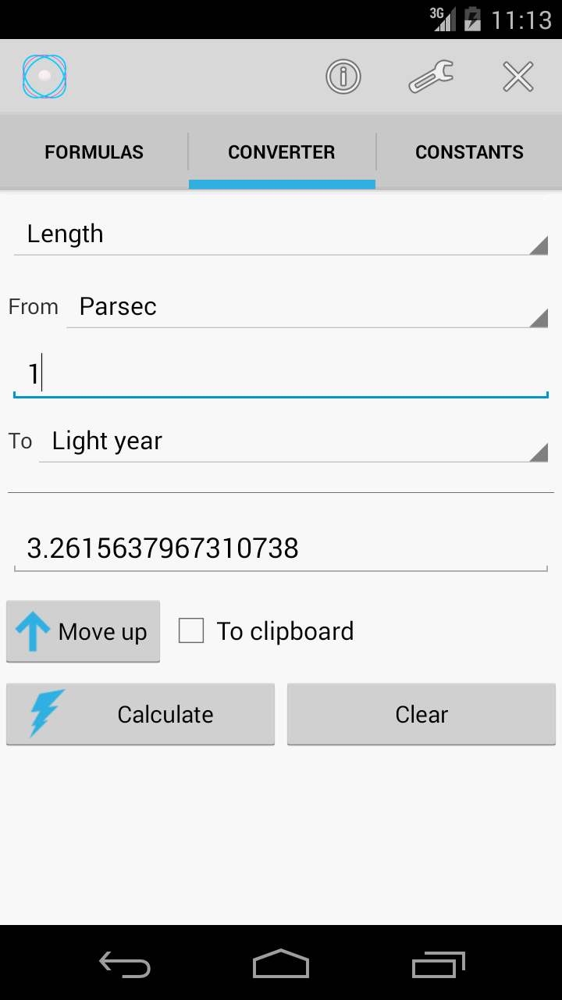
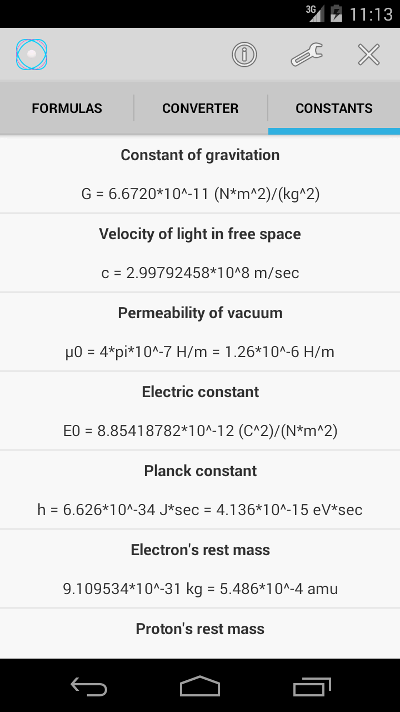

#<table>
  <tr>
    <td valign="top"></td>
    <td valign="middle">PhysicsLab</td>
  </tr>
</table>
Android application for learning physics formulas and converting between physical units.

  
  
  

<i>Fig. 1: The first tab. Formulas by topic.</i>
  

  
  

<i>Fig. 2: The second and third tabs. Converter and the fundamental physical constants.</i>
